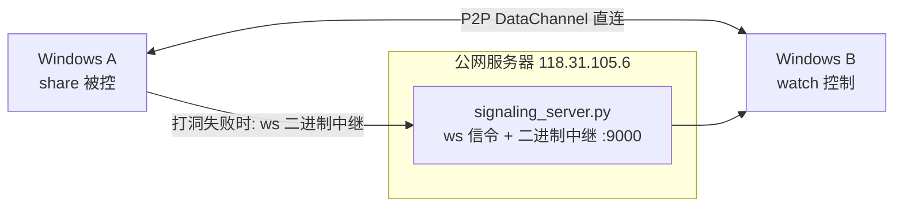

# p2pdesk

纯 Python 实现的双向远程桌面：P2P 优先（aiortc/WebRTC DataChannel），失败自动回落到公网服务器中继。

## 架构



- 服务器只用 `ws://`（无 TLS），信令与中继共用 9000 端口，纯 Python 3.9 可跑。
- 两台 Windows 跑同一个 `p2pdesk.py`，`share` 即被控、`watch` 即控制，角色可随时互换实现互相控制。

## 部署（服务器，一次性）

```bash
pip install -r server/requirements.txt
# 建议用环境变量覆盖 token：
set P2PDESK_TOKEN=your-secret-token-here
set P2PDESK_PORT=9000
python signaling_server.py
```

## 使用（两台 Windows）

客户端配置在 `client/.env`（参照 `client/.env.example` 填写 token 等；真实 `.env` 已配好可直接用）。

最简单：把 `client/` 整个文件夹拷到目标机，双击 cmd 脚本即可（自动检查/安装依赖）：

- `启动-被控.bat`：本机作为被控端常驻（对方可随时连入控制）。
- `启动-主控.bat`：控制对方。可拖拽参数运行 `启动-主控.bat 对方ID`，或无参双击后自动列出在线设备再输入 ID。
- `启动-看在线.bat`：仅查看当前在线设备。

等价命令行方式（脚本内部即这些命令）：

```bash
python p2pdesk.py share           # 被控
python p2pdesk.py list            # 查看在线 ID
python p2pdesk.py watch <peer_id> # 控制
```

`.env` 支持项：`P2PDESK_SERVER`（默认 ws://118.31.105.6:9000）、`P2PDESK_TOKEN`、`P2PDESK_ID`（留空自动用 Windows 用户名）、`P2PDESK_FPS`（默认10）、`P2PDESK_Q`（JPEG质量默认50）、`P2PDESK_P2P_TIMEOUT`（默认25秒后回落）。环境变量优先级高于 `.env`。

## 协议

- 信令 JSON：`register/list/offer/answer/bye/ping`
- 中继二进制帧：`[0x01][目标ID][0x00][数据]`，服务器原样转发并替换为来源 ID
- 媒体帧（两种传输层一致）：`[u32长度][端口0x10图像/0x20事件][载荷]`，图像为 JPEG，事件为 JSON

## 注意

- ws 明文 + 默认 token 仅适合个人自用，公网长期开放请改强 token。
- 对称 NAT 下 P2P 打洞可能失败，会自动走服务器中继（此时带宽吃服务器）。
- 控制端窗口内打字直接透传；ESC/q 退出。
